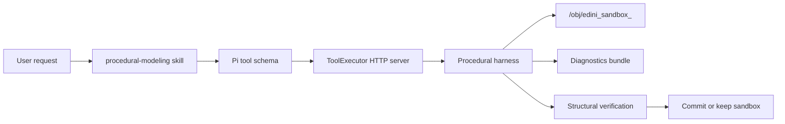
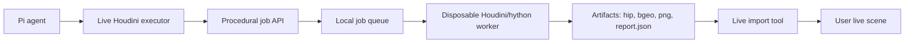

# Edini Procedural Harness Design

> Status: Draft for user review - 2026-06-11

## Goal

Build a safer procedural modeling harness for Edini so AI-generated Houdini assets are created through an observable, recoverable workflow instead of raw `houdini_run_python` experiments in the user's live scene.

The first implementation target is the medium harness, named Phase B in the incident review. Phase B must solve the ladder-session failure mode: code-first generation started correctly, but the first cook error returned too little diagnostic information, the agent fell back to ad hoc node scripting, geometry inspection failed, viewport capture was unreliable, and repeated UI probing likely destabilized Houdini.

The design must also leave a clean path to Phase C: an isolated job runner where risky cook/render work can happen in a disposable Houdini or hython process before importing proven results into the live session.

## Context

The ladder session on 2026-06-11 showed these concrete failures:

- `procedural-modeling` was loaded, but it only guided behavior; it did not provide enforceable execution rails.
- The first persistent Python SOP failed with `Error while cooking`, but `houdini_run_python` returned only the exception string.
- The agent deleted the failed Python SOP instead of preserving it for diagnosis.
- The fallback node network guessed parameter names, hit `NoneType` errors, then corrected by probing parameters.
- `houdini_inspect_geo` failed because it called `BoundingBox.size()`, which is not available in this Houdini API shape.
- `houdini_capture_viewport` failed because `hou.SceneViewer` does not provide `.grab()`.
- After safe tools failed, the agent explored Qt and viewport internals directly from `houdini_run_python`, ending in connection failures.

Current relevant files:

| File | Role |
| --- | --- |
| `python3.11libs/edini/node_utils.py` | Houdini-side tool implementations used by the live app |
| `edini/node_utils.py` | Source mirror for development/testing |
| `python3.11libs/edini/tool_executor.py` | HTTP dispatcher inside Houdini |
| `edini/tool_executor.py` | Source mirror for dispatcher tests |
| `pi-extensions/edini-tools/tools/script.ts` | Pi tool definitions for Python, VEX, and HDA tools |
| `skills/procedural-modeling/SKILL.md` | Procedural modeling behavior guidance |
| `tests/mock_hou.py` | Mock Houdini API for ordinary Python tests |
| `tests/test_node_utils.py` | Existing node utility tests |

## Design Principles

1. Keep the user's live scene protected by default.
2. Prefer structured diagnostics over retries.
3. Treat visual verification as a stable tool capability, not something the agent improvises through Qt.
4. Make every generated asset inspectable by node path, geometry statistics, errors, warnings, and expected features.
5. Make Phase B useful without requiring a full external process runner.
6. Shape Phase B APIs so Phase C can move execution out of process without changing the Pi-facing workflow.

## Phase B Scope

Phase B adds a procedural harness inside the current Houdini process. It does not yet isolate crashes at the OS process level, but it reduces the chance of crashing by preventing unbounded UI probing and by wrapping generated work in sandbox nodes with diagnostics.

### Phase B Capabilities

- Fix existing inspection and capture tools.
- Return traceback and structured diagnostics from Python execution.
- Create procedural work in `/obj/edini_sandbox_<id>` by default.
- Collect node diagnostics without requiring the agent to write probing scripts.
- Verify generated assets against simple structural expectations.
- Update the procedural modeling skill so it tells agents to use the harness first.
- Keep raw `houdini_run_python` available for expert/debug use, but make its description and guidelines steer normal modeling tasks toward harness tools.

### Phase B Non-Goals

- No external Houdini worker process yet.
- No full HIP snapshot/restore system yet.
- No general-purpose security sandbox for arbitrary Python.
- No complex semantic model of every possible procedural asset.
- No automatic publishing to HDA or package formats.

## Phase B Architecture



### Core Data Shapes

The harness should use plain JSON-serializable dictionaries. These shapes are intentionally simple so they can be returned through the existing HTTP tool executor and later reused by an external worker.

`ProceduralRecipe`:

```json
{
  "asset_type": "ladder",
  "name": "procedural_ladder",
  "backend": "python_sop",
  "parameters": {
    "height": 4.0,
    "width": 1.0,
    "rungs": 8,
    "rail_radius": 0.04,
    "rung_radius": 0.025
  },
  "expected": {
    "min_points": 1,
    "min_prims": 1,
    "bounds_nonzero": true,
    "components": {
      "rails": 2,
      "rungs": 8
    }
  }
}
```

`DiagnosticsBundle`:

```json
{
  "success": false,
  "sandbox_id": "20260611_123456_ladder",
  "root_path": "/obj/edini_sandbox_20260611_123456_ladder",
  "node_path": "/obj/edini_sandbox_20260611_123456_ladder/ladder_generator",
  "error": "The attempted operation failed.\nError while cooking.",
  "traceback": "...",
  "node_errors": ["..."],
  "node_warnings": [],
  "created_nodes": ["/obj/edini_sandbox_20260611_123456_ladder"],
  "geometry": {
    "point_count": 0,
    "prim_count": 0,
    "vertex_count": 0,
    "bounds": null
  }
}
```

`VerificationResult`:

```json
{
  "success": true,
  "node_path": "/obj/procedural_ladder/OUT",
  "geometry": {
    "point_count": 240,
    "prim_count": 160,
    "vertex_count": 640,
    "bounds": {
      "min": [-0.54, 0.0, -0.04],
      "max": [0.54, 4.0, 0.04],
      "size": [1.08, 4.0, 0.08]
    }
  },
  "checks": [
    {"name": "min_points", "passed": true, "actual": 240, "expected": 1},
    {"name": "bounds_nonzero", "passed": true, "actual": [1.08, 4.0, 0.08]},
    {"name": "node_errors", "passed": true, "actual": []}
  ]
}
```

## Phase B Tool Surface

### `houdini_collect_diagnostics`

Collect node-level diagnostic information without changing the scene.

Parameters:

```json
{
  "node_path": "/obj/procedural_ladder/OUT",
  "include_geometry": true,
  "include_parms": false
}
```

Returns node existence, type, errors, warnings, selected parameter values when requested, geometry counts, attributes, and bounds. This tool replaces ad hoc `dir()` and parameter probing for normal troubleshooting.

### `houdini_run_python_sandbox`

Execute Python code against a sandbox root under `/obj`, capture stdout/stderr/traceback, and return created root path.

Parameters:

```json
{
  "code": "root = hou.node(sandbox_root_path)\n...",
  "sandbox_name": "procedural_ladder",
  "commit_on_success": false,
  "delete_on_failure": false
}
```

Execution context includes:

```python
hou
sandbox_root_path
result
```

The agent writes results into the `result` dictionary when useful:

```python
result["output_node"] = out.path()
result["asset_type"] = "ladder"
result["components"] = {"rails": 2, "rungs": 8}
```

By default, failed sandboxes remain for inspection. The harness may clean old sandboxes by age or count in a later maintenance pass.

### `houdini_verify_asset`

Verify an asset node structurally.

Parameters:

```json
{
  "node_path": "/obj/procedural_ladder/OUT",
  "expected": {
    "min_points": 1,
    "min_prims": 1,
    "bounds_nonzero": true,
    "components": {"rungs": 8}
  }
}
```

Phase B supports generic geometry checks and optional component checks if the generating code writes detail attributes or returns a `components` result. It does not try to infer complex object semantics from mesh topology alone.

### `houdini_commit_sandbox`

Move or rename a sandbox asset into its final object path after verification passes.

Parameters:

```json
{
  "sandbox_root_path": "/obj/edini_sandbox_20260611_123456_ladder",
  "final_name": "procedural_ladder",
  "replace_existing": false
}
```

If `replace_existing` is false and a node already exists, the tool returns a conflict instead of overwriting.

### `houdini_discard_sandbox`

Delete a sandbox root explicitly.

Parameters:

```json
{
  "sandbox_root_path": "/obj/edini_sandbox_20260611_123456_ladder"
}
```

This keeps cleanup deliberate and visible.

### `houdini_capture_viewport_safe`

Capture the viewport using a single supported strategy. Phase B should prefer `SceneViewer.flipbook(viewer.curViewport(), settings)` because that path succeeded in the ladder session. If it fails, return diagnostics. Do not fall back to Qt widget spelunking.

Parameters:

```json
{
  "filepath": "E:/houdini/screenshots/ladder_v1.png",
  "frame": 1,
  "home_viewport": true
}
```

This tool is allowed to report "capture unavailable" rather than trying increasingly risky API guesses.

## Changes to Existing Tools

### `inspect_geometry`

Replace `geo.boundingBox().size()` with explicit min/max/size extraction using methods or intrinsic bounds known to be available.

Expected bounds shape:

```json
{
  "min": [0.0, 0.0, 0.0],
  "max": [1.0, 4.0, 1.0],
  "size": [1.0, 4.0, 1.0]
}
```

If a bounding box cannot be computed, return `bounds: null` and keep point/prim counts.

### `run_python`

Keep this tool, but improve failure reporting:

- include `traceback`;
- capture stderr as well as stdout;
- restore streams in `finally`;
- include a warning that raw execution is not sandboxed;
- do not hide partial output on failure.

The tool remains useful for advanced troubleshooting, but normal procedural modeling should use `houdini_run_python_sandbox`.

### `capture_viewport`

Either rewrite it to call the same safe flipbook implementation or deprecate it in favor of `houdini_capture_viewport_safe`. The Pi-facing prompt should not encourage direct Qt capture.

## Skill Update

`skills/procedural-modeling/SKILL.md` should be updated so the required workflow becomes:

1. Create a structured recipe.
2. Choose backend: `python_sop`, `vex_wrangle`, or `node_network`.
3. Use sandbox/harness tools for generation.
4. Collect diagnostics after any failure.
5. Verify geometry structurally.
6. Capture visual output through the safe capture tool only.
7. Commit sandbox only after verification passes.

The skill should explicitly say:

- Do not delete a failed procedural node before collecting diagnostics.
- Do not use raw `houdini_run_python` for initial procedural asset generation when sandbox tools are available.
- Do not explore Qt widgets or unsupported viewport internals during normal modeling.
- For Python SOP cook errors, diagnose the Python SOP code and node errors before changing strategy.

## Testing Strategy

Phase B tests should run in ordinary Python where possible.

Unit tests with `tests/mock_hou.py`:

- `inspect_geometry` returns counts and bounds without using `BoundingBox.size()`.
- `run_python` returns traceback and partial stdout on failure.
- `collect_diagnostics` handles missing nodes, nodes with errors, nodes with geometry, and nodes without geometry.
- `run_python_sandbox` creates sandbox roots, preserves failed sandboxes by default, and returns result metadata.
- `verify_asset` fails on empty geometry and passes on non-empty geometry.

Integration checks in real Houdini or hython:

- Optional smoke script creates a ladder sandbox and verifies geometry.
- Optional screenshot smoke uses `flipbook(viewer.curViewport(), settings)` and checks that an image file exists and is non-empty.

Pi extension checks:

- TypeScript tool definitions include the new harness tools.
- Tool descriptions steer agents away from raw Python for procedural modeling.

## Success Criteria for Phase B

- The ladder scenario can be rerun without deleting the first failed artifact before diagnostics.
- A failed Python SOP returns traceback, node path, errors/warnings, and sandbox path.
- Geometry inspection works for generated SOP nodes.
- Viewport capture either succeeds through the safe method or fails cleanly without Qt probing.
- The procedural modeling skill instructs the agent to use the harness.
- Ordinary `pytest tests -q` passes, excluding pre-existing Houdini-only scripts outside `tests/`.

## Phase C Target Architecture

Phase C moves risky procedural jobs out of the live Houdini process.



The live Houdini process becomes an orchestrator and importer. The worker process owns risky cook/render attempts. If the worker crashes, the live scene survives.

### Phase C Components

`edini/harness/job_models.py`:

- `ProceduralJob`
- `ProceduralJobResult`
- `ArtifactManifest`
- `JobStatus`

`edini/harness/job_queue.py`:

- local filesystem-backed queue under an Edini cache directory;
- records submitted, running, succeeded, failed, crashed states;
- stores stdout/stderr and report JSON.

`edini/harness/worker_runner.py`:

- launches `hython.exe` or a Houdini batch process;
- passes job input path;
- enforces timeout;
- detects non-zero exit and missing report;
- writes crash-safe result.

`edini/harness/importer.py`:

- imports generated `.bgeo.sc`, `.hip`, or subnet definitions into the live scene;
- applies final naming and display flags;
- refuses to overwrite unless requested.

`scripts/edini_harness_worker.py`:

- entry point run by hython;
- loads job JSON;
- creates geometry or node network;
- cooks;
- writes artifacts and report.

### Phase C Tool Surface

The Phase B tool names should not become dead ends. Add optional execution modes over time:

```json
{
  "execution_mode": "live_sandbox"
}
```

Later:

```json
{
  "execution_mode": "external_worker"
}
```

The agent should continue calling the same conceptual workflow:

1. submit/create procedural job;
2. inspect diagnostics;
3. verify result;
4. import/commit.

Only the backend changes from live sandbox to worker process.

## Migration Path from B to C

### C0: Phase B with C-shaped APIs

Implement Phase B using names and result shapes that match the future job model:

- `sandbox_id` becomes `job_id` later.
- `DiagnosticsBundle` becomes part of `ProceduralJobResult`.
- `houdini_run_python_sandbox` returns artifact-like metadata even though artifacts are still live nodes.

### C1: Filesystem Artifact Manifest

Start writing a `report.json` next to sandbox screenshots or generated files even in Phase B.

Example:

```json
{
  "job_id": "20260611_123456_ladder",
  "execution_mode": "live_sandbox",
  "status": "succeeded",
  "live_node_path": "/obj/edini_sandbox_20260611_123456_ladder/OUT",
  "screenshots": ["E:/houdini/screenshots/ladder_v1.png"],
  "geometry": {"point_count": 240, "prim_count": 160}
}
```

This makes later external-worker results feel familiar.

### C2: Optional hython Validation

Add a tool or script that can take a Python SOP snippet or node-network recipe and test it in hython for structural validity. Hython cannot fully replace GUI visual checks, but it can catch syntax errors, parameter name mistakes, and artifact generation failures before touching the live scene.

### C3: External Geometry Worker

Support jobs that output geometry artifacts such as `.bgeo.sc` plus `report.json`. The live scene imports the artifact into a File SOP or subnet. This is the first real crash-isolation milestone.

### C4: External HIP/Subnet Worker

Support richer jobs that output `.hip` or a subnet package for import. This handles assets where the node network itself matters, not just the final geometry.

### C5: Worker Pool and UI

Expose job state in Edini UI:

- queued/running/succeeded/failed/crashed;
- open diagnostics;
- import result;
- discard artifacts;
- retry in live sandbox or external worker.

This phase is product polish, not required for initial crash isolation.

## When to Move from B to C

Move to Phase C when any two of these are true:

- A modeling task crashes or hangs Houdini again after Phase B safeguards.
- Visual/render validation remains unreliable in the live process.
- Python SOP/VEX generation needs long-running cooks.
- Users want to run multiple variants and compare outputs.
- Generated assets need reproducible artifact history.
- Edini starts supporting third-party or user-submitted procedural recipes.

## Open Decisions

1. Whether the first external worker should output `.bgeo.sc` only or support `.hip` immediately.
2. Where job artifacts should live by default: project-local `.edini/jobs`, Houdini `$HIP/edini_jobs`, or user cache.
3. Whether sandbox cleanup should be automatic by age/count or explicit only.
4. Whether raw `houdini_run_python` should gain a visible "unsafe" label in the UI.

## Recommended First Implementation Plan

The first plan should implement Phase B only, while adding C-compatible result shapes.

Recommended task order:

1. Fix existing `inspect_geometry`, `capture_viewport`, and `run_python` diagnostics.
2. Add `edini/harness` helper functions in both source and runtime copies, or choose one source-of-truth sync strategy first.
3. Add `houdini_collect_diagnostics`.
4. Add `houdini_run_python_sandbox`.
5. Add `houdini_verify_asset`.
6. Add `houdini_commit_sandbox` and `houdini_discard_sandbox`.
7. Register Pi extension tools.
8. Update `procedural-modeling` skill.
9. Add a ladder regression fixture.
10. Document Phase C migration in the wiki after Phase B tests pass.

## Review Notes

This design intentionally avoids implementing Phase C immediately. The live Houdini process still cannot be made fully crash-proof in Phase B, but Phase B eliminates the most obvious failure loops: opaque cook errors, failed geometry inspection, unsafe screenshot improvisation, and deleting failed procedural nodes before diagnosis.

